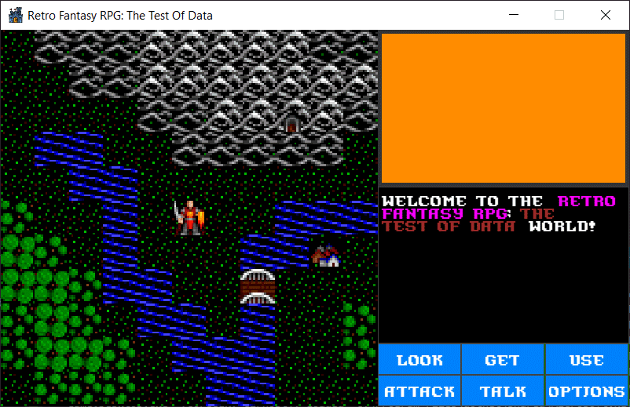
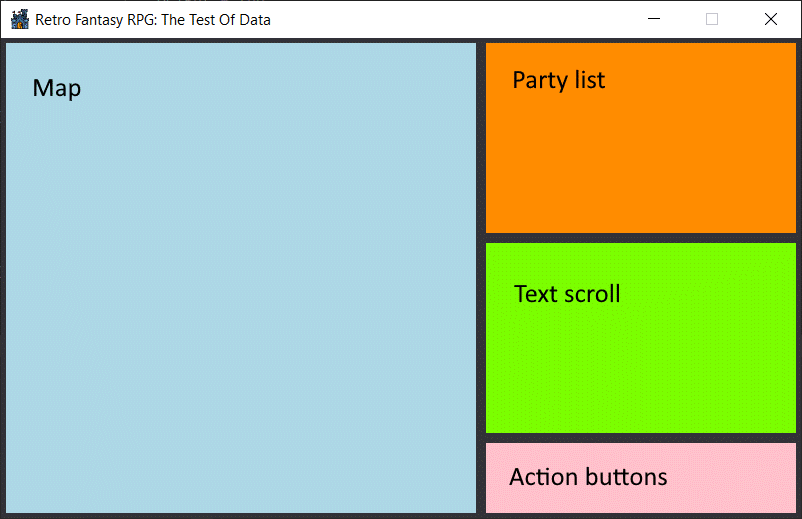

# Development Log

## 2020-11-28 Day 8: Map view

The map view shows all tiles of a tile based map. The Ultima games show a
11x11 tile grid with the player in the center. In combat screens there are
fixed maps where the party characters can freely move around. I'd like to
implement the map the same way.

First, I needed some tiles. Fortunately there are many pre-made tilesets that
can be used free of charge or with a permissive license. My plan is to later
draw the tiles by myself, but for implementing and testing the game's basic
functions, I decided to use the fan-made tileset that is used to enhance the
original Ultima 4 game. It can be used freely and has many tiles that I need.

Tiles and tile maps can be designed using various tools. In the past I used
Pyxel to draw tiles, and the Tiled map editor to draw maps that are compatible
with MonoGame.Extended. These can be loaded using the Content manager, just as
any other asset.

I also lifted some code for map visibility checking from an older project.
Some tiles can be marked solid, and the player only sees the tiles that are in
direct line of sight. Maps then can be marked as using visibility checks or
not. And I added two maps, a "Wilderness" map with a large island and several
cities, and a map named "Bob's Hut". The next task will be to implement
movement and allow the player to change maps.

Now, with map rendering implemented, the game looks like this:

## 2020-11-15 Day 7: Message scroll

The message scroll is a central element in the user interface, since it shows
responses to actions that the user takes, and possibly any other textual info
the player needs. The message scroll should break text on word breaks and
support colored words.

Coding this was easier than I thought. I split the logic of handling all the
message scroll text breaking and coloring to a new view model class. The view
class just renders the text that comes from the view model. A color modifier
character (~) can be used to switch colors in the middle of a sentence. The
handling of finding word breaks and length of strings got a little more
complicated, though. And the best thing is, the message scroll can be reused
when doing a conversation dialog.

## 2020-11-06 Day 6: Initial in-game screen layout

Today I tried out how the in-game screen could look. Various RPGs from the
good old days have different approaches for the user interface. Ultima 1-2
uses an almost full-screen map with with some scrolled lines of text on the
bottom. Ultima 3 switched to a square map on the left, maximizing the map's
size, and put party roster and messages to the left.

Other games, e.g. the
gold box series, had an almost tiny 3D map view, a huge party roster and some
message lines on the bottom. The tactical combat screen uses a different
layout, maximizing the map and using an isometric (or better, axonometric)
projection.

I played around with positioning the various game windows that I'd like to
have, and came up with this layout:

The map should cover all of the left side, whereas the party list, text scroll
and action buttons should be on the right. The map should be square, using
Ultima styled tiles, with a tile size of 11x11, just as the original games.
This also allows for tactical combat screens to use the same user interface.
The party list should show all party members, along with some stats like
vitality. I don't know yet if the party list must be scrollable.

The text scroll, on the other side, should be scrollable. The Gui framework
currently has no scroll bar, so this may mean to develop one. The action
buttons should be the easiest. They can be used to start actions like "Look",
"Talk", "Use" and "Attack" and should also have keyboard key equivalents.

## 2020-11-05 Day 5: Bug fixes and game data serialization

I found a fix for the Android bug; apparently, the Android didn't pick up the
Content folder from the .NET Standard project. I would have been an elegant
way to share the Content folder this way, but oh well. Now I'm referencing the
Content.mgcb file from both projects.

I also fixed the start game screen layout by just inserting another
transparent view above the buttons. I also added an initial screenshot to the
front page.

Another thing I have implemented was the actual loading and saving of the
savegame. On Android the game data is stored in the app's data folder. On
Windows it is stored in the roaming AppData folder. The game data is still
empty, but the facílity is already there.

Now it's time to implement the actual in-game screen, map drawing, movement
controls, game commands and more...

## 2020-11-04 Day 4: Reviewing bugs

Not much coding today, as I'm trying to fix several bugs:
- First, the Android app doesn't run, since it doesn't find the compiled
  Content folder that is generated by the .NET Standard project.
- Second, on Windows the UI I'm trying to implement doesn't show correctly;
  the three buttons (a "Start new game", a "Journey Onward" to load an
  existing savegame and an "Exit" button) are not correctly positioned below
  the game's title.
- Also previously I didn't check in all code, so the code compiled on my
  machine, but not on others; time to use Continuous Integration...

The first bug probably occurs, since the .NET Standard template generated a
`Content.mgcb` file, but has no way to merge the generated Assets witht the
Xamarin.Android project. Either the project template is faulty, or that isn't
supposed to work that way.

For the second one, I'm reading the code for `MonoGame.Extended.Gui`, but
didn't find a clue yet. Time to debug into that assembly, to see if I'm doing
something wrong or the library isn't working correctly.

For the third point, let's see if I can set up AppVeyor to both build an
Android app and a Windows Desktop app as soo as I'm committing a change.

## 2020-11-03 Day 3: Graphical User Interface

Now it's time to do the actual user interface, I thought. My idea is to have
two different game screens, a start screen and the actual in-game screen. The
start screen should display the title of the game in a nice RPG style font,
and some buttons to start a new game and to continue a saved game.

I looked at previous (unfinished) game projects and decided to use
`MonoGame.Extended`, as I already had some code lying around. The NuGet
package `MonoGame.Extended.Screens` offers a screen component that can
switch between different logical screens that all have their own
`LoadContent()/Update()/Draw()` calls, just like a `Game` object. This
helps separating the logic code of both pages.

I also thought about how to logically structure the code to separate drawing
the world from actually storing and updating the world. As I wrote some
Xamarin apps before, the MVVM (Model View ViewModel) pattern naturally came to
my mind.

MVVM works as follows: You have a View class (or several views, e.g. buttons)
and the views are able to draw themselves. The state of the view (e.g. is a
button active, or what to do when a button is pressed) is coded in the
ViewModel class that acts as a binding class to the Model. The model classes
describe the game world and its logic, e.g. the current map, the players's
stats and what monsters are running around.

Tomorrow I'll write a bit more about the UI...

## 2020-11-02 Day 2: Game data

Today I thought about how to handle the game's data. I want to store the
game's state when the user closes the app, so the game can be continued from
where the user left of. Some sort of auto-save functionality. The game state
can contain the player's current stats, the monsters in the game world and
objects that can be picked up. We also have static data that never chages,
e.g. the base map, town layout or the conversation trees for NPCs.

The game state can map to properties in C# classes, and the static game data
could be modeled as C# static properties of a C# class. So today I wrote a
GameData that encapsulates both data. Currently the class is only a skeleton
class, but I wrote a `Save()`, `Load()` and a `Create()` method. For loading
and saving the game state, I use Newtonsoft.Json to just serializing the game
data to JSON. `Create()` just generates a new empty game data object, but
later will be populated with the initial state. The static game data just
contains two properties, the game's name and subtitle.

## 2020-11-01 Day 1: Creating projects

Today I set up my little side project, a retro-style, fantasy RPG game. I
chose MonoGame as the framework, since I already coded some demos and half
finished projects with it. Some of the code will end up here.

Setting up the projects in Visual Studio 2019 was rather easy. The MonoGame
3.8.0 version comes with project templates, no SDK anymore to install. The
generated projects reference NuGet projects, and the MonoGame Content Builder
can be installed as a dotnet tool.

I created an Android project that uses Xamarin.Android and a cross-platform
desktop project. I added some icons from a free icon site, in order to have a
framework to build on. Most of the code will be in the Core project from here
on. It is a .NET Standard project that can also have a Content folder with
MonoGame content.

Finally for today, I ported over a "virtual drawing area" code that provides
a 800x480 drawing area that is scaled automatically to the desktop window's
size (or the Android Activity).
